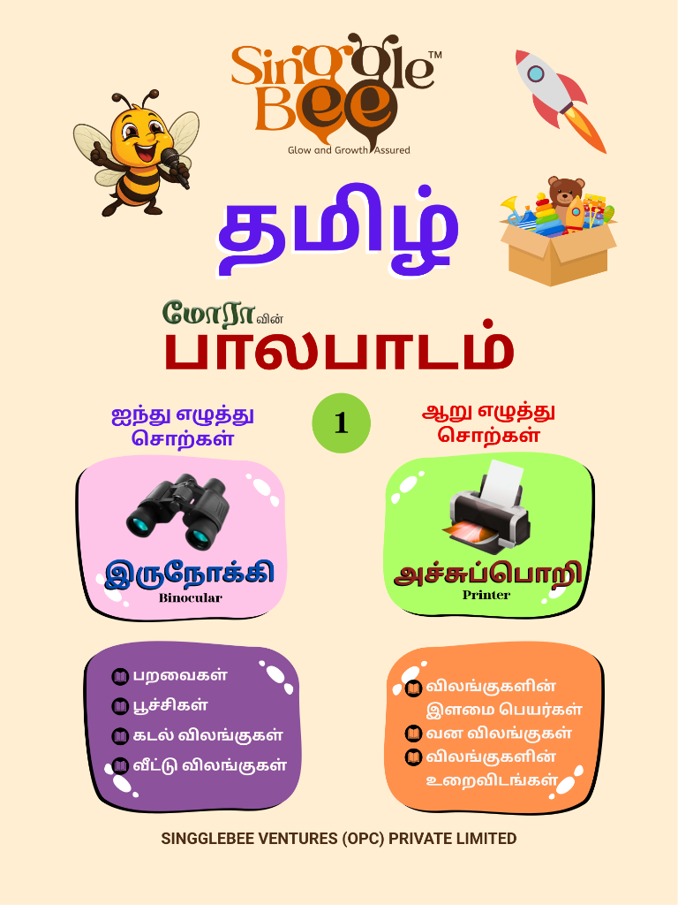
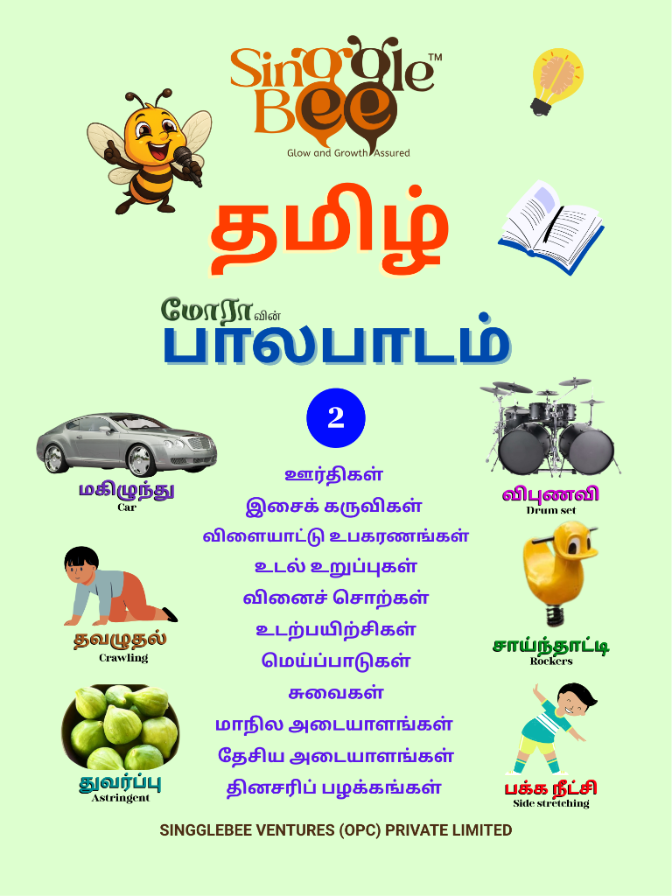
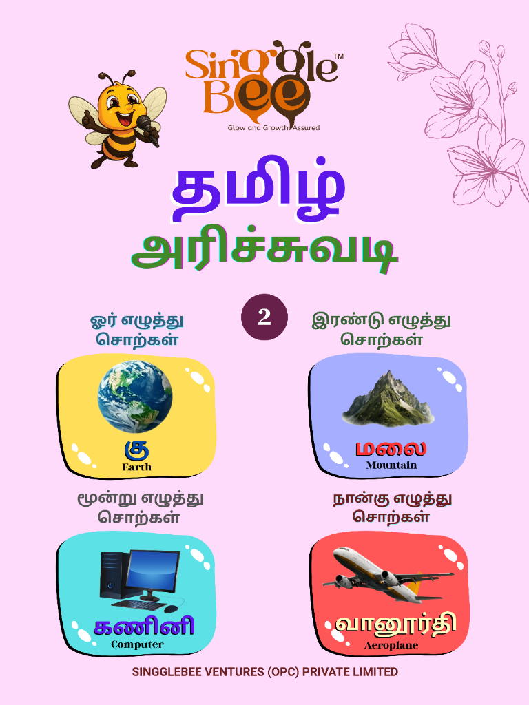

<div align="center">
  
  <h1>🐝 SINGGLEBEE</h1>
  <p><strong>The Sweetest Place for Knowledge, Treats, and Premium Goods.</strong></p>

[](https://reactjs.org/)
[](https://www.typescriptlang.org/)
[](https://tailwindcss.com/)
[](https://vitejs.dev/)

</div>

---

## 🍯 Overview

**SINGGLEBEE** is a premium, nature-inspired e-commerce platform dedicated to bringing families the finest selection of books, gourmet honey, and high-quality stationery. Our platform is crafted with a meticulous focus on visual excellence, featuring a glassmorphic UI that is as delightful to use as it is beautiful to behold.

## ✨ Signature Features

- **🎨 Artisan Visuals**: High-end glassmorphism and a consistent "Honeycomb" design language.
- **📱 Fluid Responsiveness**: A "Perfect Phone UI" optimized for every screen size and touch gesture.
- **🛒 Elegant Cart**: A seamless, persistent shopping experience with a stunning sliding drawer.
- **🛡️ Secure Transactions**: Professional checkout flows with manual UPI/GPay verification and receipt uploads.
- **💌 Integrated Communications**: Scalable contact, newsletter, and review systems powered by Formspree.
- **🔍 Precision Discovery**: Category-based filtering and smart search to find your favorites instantly.

## 🛠️ The Tech Hive

| Technology        | Purpose                                                       |
| :---------------- | :------------------------------------------------------------ |
| **React 18**      | High-performance UI library for the modern web.               |
| **TypeScript**    | Type-safe development for a robust and maintainable codebase. |
| **Tailwind CSS**  | Atomic CSS framework drive premium, custom aesthetics.        |
| **Vite**          | Lightning-fast build tooling for an optimized dev experience. |
| **Lucide & SVGs** | Crisp, professional iconography and custom brand assets.      |
| **Formspree**     | Powering our dynamic forms and order processing.              |

## 🚀 Getting Started

Follow these steps to bring the hive to life on your local machine.

### 1. Clone the Hive

```bash
git clone https://github.com/your-username/singglebee.git
cd singglebee
```

### 2. Gather the Nectar

```bash
npm install
```

### 3. Let it Buzz

```bash
npm run dev
```

Explore the magic at: `http://localhost:5173`

---

## 🏗️ Production Deployment

When deploying to production (e.g., Vercel, Docker, or Render), ensure the following:

- **Frontend Build**: The `GEMINI_API_KEY` MUST be provided as an environment variable during the build command (`npm run build`). This is because Vite bakes environment variables into the static assets at build time.
- **Backend Environment**: Ensure `JWT_ACCESS_SECRET`, `JWT_REFRESH_SECRET`, and `MONGO_URI` are securely configured in your hosting provider's dashboard.
- **HTTPS**: The backend is configured to use secure cookies in production. Ensure your load balancer (Nginx/Vercel) correctly forwards headers (e.g., `X-Forwarded-For`) for rate limiting and security.

---

## 📸 Hive Gallery

<div align="center">
  <table>
    <tr>
      <td align="center"><strong>Premium Hero</strong></td>
      <td align="center"><strong>Product Details</strong></td>
    </tr>
    <tr>
      <td align="center"></td>
      <td align="center"></td>
    </tr>
    <tr>
      <td align="center"><strong>Mobile Excellence</strong></td>
      <td align="center"><strong>Secure Checkout</strong></td>
    </tr>
    <tr>
      <td align="center"></td>
      <td align="center"></td>
    </tr>
  </table>
</div>

---

## 🐝 Author

**singglebee**  
_Nurturing growth and sweetness in every click._

---

<div align="center">
  <p>© 2026 SINGGLEBEE. All Rights Reserved.</p>
</div>
