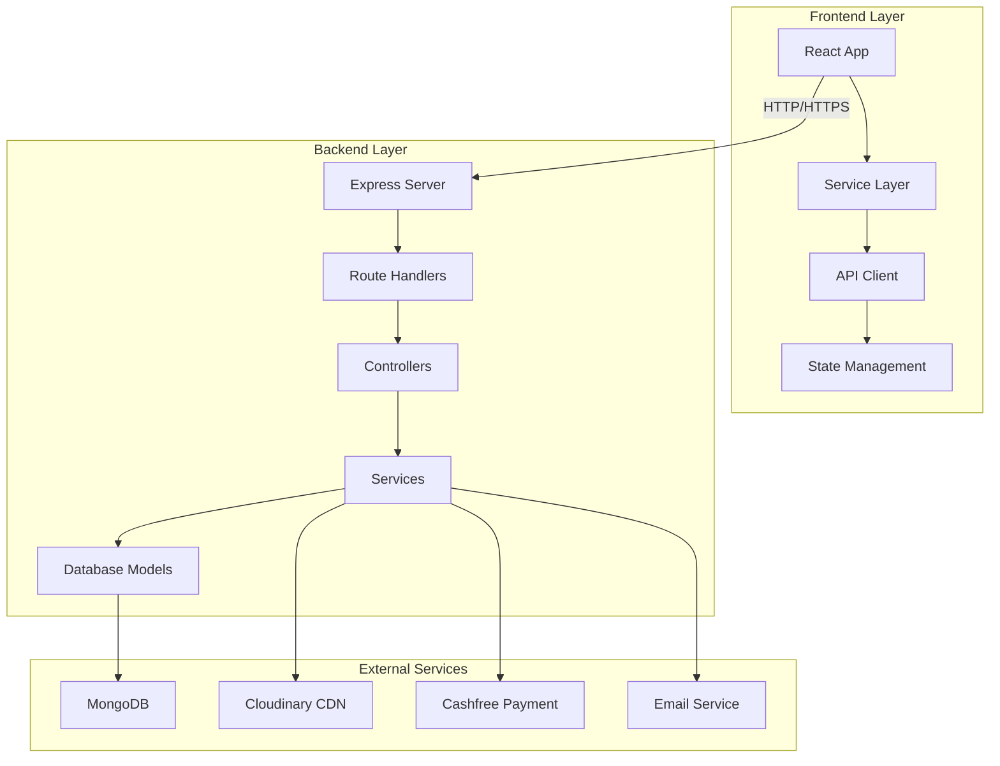
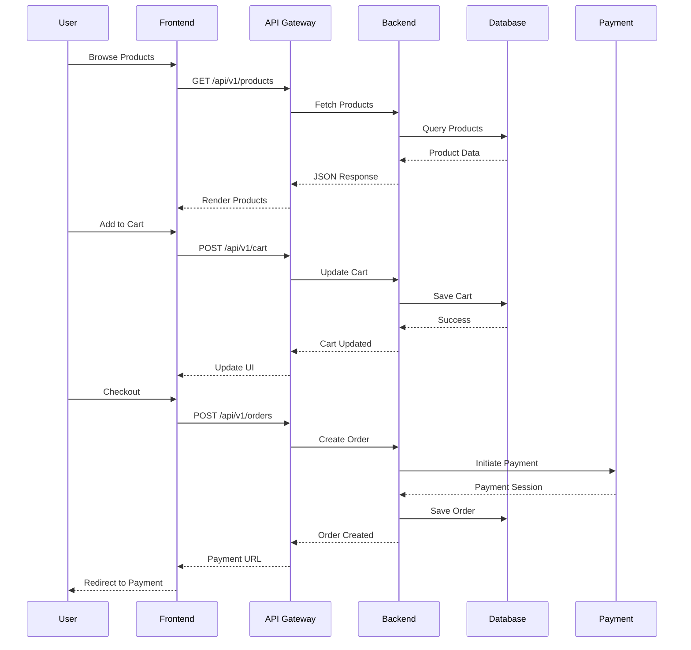
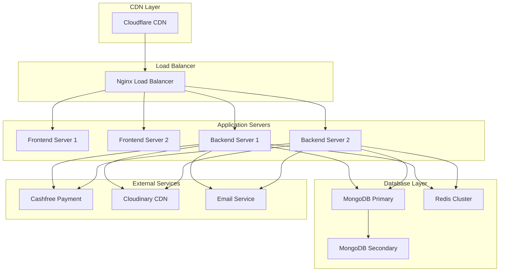

# SINGGLEBEE E-Commerce Platform - Full-Stack Integration Architecture

## 📋 Table of Contents
1. [Project Overview](#project-overview)
2. [Technology Stack](#technology-stack)
3. [System Architecture](#system-architecture)
4. [Database Design](#database-design)
5. [API Contract](#api-contract)
6. [Frontend Integration](#frontend-integration)
7. [Backend Implementation](#backend-implementation)
8. [Authentication & Security](#authentication--security)
9. [Payment Integration](#payment-integration)
10. [Development Setup](#development-setup)
11. [Deployment Architecture](#deployment-architecture)
12. [Migration Guide](#migration-guide)

---

## 🎯 Project Overview

**Repository**: [github.com/sraj1009/SB-website](https://github.com/sraj1009/SB-website)

SINGGLEBEE is a specialized e-commerce platform for Tamil educational books and literature, featuring a glassmorphic honeycomb design aesthetic with warm color palette.

### **Product Categories**
- **Tamil Educational Books**: அரிச்சுவடி, பாலபாடம்
- **Poem Collections**: பட்டம் பறக்கும் பட்டம்
- **Story Books**: Traditional and contemporary Tamil literature
- **Educational Materials**: Learning resources for all age groups

### **Design System**
- **Primary Color**: Honey Amber (#FFA500)
- **Secondary**: Cream (#FFF8E7)
- **Accent**: Forest Green (#2D5016)
- **Theme**: Glassmorphic honeycomb patterns

---

## 🛠️ Technology Stack

### **Frontend**
```typescript
{
  "framework": "React 19.2.3",
  "language": "TypeScript 5.8.2",
  "bundler": "Vite 6.2.0",
  "styling": "Tailwind CSS 4.1.18",
  "icons": "Lucide React",
  "state": "React Hooks + Context API",
  "routing": "React Router",
  "forms": "React Hook Form",
  "http": "Axios"
}
```

### **Backend**
```typescript
{
  "runtime": "Node.js 18",
  "framework": "Express.js",
  "database": "MongoDB",
  "odm": "Mongoose 7.x",
  "authentication": "JWT + Refresh Tokens",
  "validation": "Joi",
  "documentation": "Swagger/OpenAPI 3.0",
  "testing": "Jest + Supertest",
  "logging": "Winston",
  "monitoring": "Prometheus"
}
```

### **Infrastructure**
```yaml
services:
  frontend:
    port: 3000
    build: Vite
  backend:
    port: 5000
    runtime: Node.js
  database:
    type: MongoDB
    port: 27017
  cdn:
    provider: Cloudinary
  payment:
    provider: Cashfree
```

---

## 🏗️ System Architecture



### **Data Flow Architecture**



---

## 🗄️ Database Design

### **1. User Schema**
```typescript
interface User {
  _id: ObjectId;
  name: string;                    // Full name
  email: string;                   // Unique email
  password: string;                // Hashed password
  phone?: string;                  // Phone number
  role: 'user' | 'admin';         // User role
  status: 'active' | 'banned' | 'suspended';
  addresses: AddressBook[];        // User addresses
  wishlist: ObjectId[];           // Product IDs
  cart: CartItem[];               // Cart items
  emailVerified: boolean;
  mustChangePassword: boolean;
  lastLogin?: Date;
  loginHistory: LoginHistory[];
  createdAt: Date;
  updatedAt: Date;
}

interface LoginHistory {
  timestamp: Date;
  ip: string;
  userAgent: string;
}
```

### **2. Product Schema**
```typescript
interface Product {
  _id: ObjectId;
  title: string;                   // Book title
  author: string;                  // Author name
  price: number;                   // Price in INR
  category: Category;              // Product category
  description: string;             // Product description
  images: string[];                // Image URLs
  stock: number;                   // Available stock
  bestseller: boolean;             // Bestseller flag
  rating: number;                  // Average rating (0-5)
  reviews: ObjectId[];             // Review IDs
  language: 'Tamil' | 'English' | 'Bilingual';
  pages: number;                   // Number of pages
  format: 'Paperback' | 'Hardcover' | 'Digital';
  isbn?: string;                   // ISBN number
  publisher?: string;              // Publisher name
  publishedYear?: number;          // Publication year
  weight?: number;                 // Weight in grams
  dimensions?: {                   // Dimensions in mm
    length: number;
    width: number;
    height: number;
  };
  tags: string[];                  // Search tags
  isActive: boolean;               // Product status
  createdAt: Date;
  updatedAt: Date;
}

enum Category {
  BOOKS = 'books',
  POEMS = 'poems',
  STORIES = 'stories',
  EDUCATIONAL = 'educational',
  CHILDREN = 'children'
}
```

### **3. Order Schema**
```typescript
interface Order {
  _id: ObjectId;
  orderId: string;                 // Sequential order ID (ORD-0001)
  user: ObjectId;                  // User ID
  items: OrderItem[];              // Order items
  totalAmount: number;             // Total order amount
  subtotal: number;                // Subtotal before discounts
  discount: number;                 // Discount amount
  tax: number;                     // Tax amount
  shipping: number;                // Shipping cost
  status: OrderStatus;             // Order status
  paymentMethod: PaymentMethod;    // Payment method
  paymentStatus: PaymentStatus;     // Payment status
  paymentSession?: ObjectId;       // Payment session ID
  paymentReceipt?: {               // Receipt for COD
    url: string;
    uploadedAt: Date;
  };
  shippingAddress: AddressBook;    // Shipping address
  billingAddress?: AddressBook;    // Billing address
  trackingNumber?: string;          // Tracking number
  estimatedDelivery?: Date;        // Estimated delivery date
  actualDelivery?: Date;           // Actual delivery date
  notes?: string;                  // Order notes
  createdAt: Date;
  updatedAt: Date;
}

interface OrderItem {
  product: ObjectId;               // Product ID
  quantity: number;                // Quantity
  price: number;                   // Price at time of order
  title: string;                   // Product title snapshot
  image: string;                   // Product image snapshot
}

enum OrderStatus {
  PENDING = 'pending',
  VERIFIED = 'verified',
  PROCESSING = 'processing',
  SHIPPED = 'shipped',
  DELIVERED = 'delivered',
  CANCELLED = 'cancelled',
  RETURNED = 'returned'
}

enum PaymentMethod {
  CASHFREE = 'cashfree',
  UPI = 'upi',
  GPAY = 'gpay',
  PHONEPE = 'phonepe',
  COD = 'cod'
}

enum PaymentStatus {
  PENDING = 'pending',
  PAID = 'paid',
  FAILED = 'failed',
  REFUNDED = 'refunded'
}
```

### **4. Review Schema**
```typescript
interface Review {
  _id: ObjectId;
  user: ObjectId;                  // User ID
  product: ObjectId;               // Product ID
  rating: number;                  // Rating (1-5)
  title?: string;                  // Review title
  comment: string;                 // Review comment
  verifiedPurchase: boolean;       // Verified purchase
  helpfulCount: number;            // Helpful votes
  isApproved: boolean;             // Admin approved
  response?: {                     // Seller response
    message: string;
    respondedAt: Date;
    respondedBy: ObjectId;
  };
  createdAt: Date;
  updatedAt: Date;
}
```

### **5. AddressBook Schema**
```typescript
interface AddressBook {
  _id: ObjectId;
  user: ObjectId;                  // User ID
  street: string;                  // Street address
  landmark?: string;               // Landmark
  city: string;                    // City
  state: string;                   // State
  zipCode: string;                 // ZIP code
  country: string;                 // Country
  isDefault: boolean;              // Default address
  addressType: 'home' | 'work' | 'other';
  createdAt: Date;
  updatedAt: Date;
}
```

### **6. Coupon Schema**
```typescript
interface Coupon {
  _id: ObjectId;
  code: string;                    // Coupon code
  name: string;                    // Coupon name
  description: string;             // Description
  discountType: DiscountType;      // Discount type
  discountValue: number;           // Discount value
  minOrder: number;                // Minimum order amount
  maxDiscount?: number;            // Maximum discount amount
  maxUses: number;                 // Maximum uses
  usedCount: number;               // Current usage count
  expiryDate: Date;                // Expiry date
  isActive: boolean;               // Active status
  applicableCategories?: Category[]; // Applicable categories
  applicableProducts?: ObjectId[];  // Applicable products
  userLimits?: {                   // Per-user limits
    maxUses: number;
    usedUsers: Map<string, number>;
  };
  createdAt: Date;
  updatedAt: Date;
}

enum DiscountType {
  PERCENTAGE = 'percentage',
  FIXED = 'fixed',
  SHIPPING = 'shipping'
}
```

### **7. PaymentSession Schema**
```typescript
interface PaymentSession {
  _id: ObjectId;
  order: ObjectId;                 // Order ID
  provider: PaymentProvider;       // Payment provider
  sessionId: string;               // Session ID
  paymentUrl?: string;            // Payment URL
  status: PaymentSessionStatus;     // Session status
  amount: number;                  // Payment amount
  currency: string;                // Currency (INR)
  webhookData?: {                  // Webhook data
    eventId: string;
    signature: string;
    payload: any;
  };
  attempts: number;                 // Payment attempts
  createdAt: Date;
  updatedAt: Date;
}

enum PaymentProvider {
  CASHFREE = 'cashfree',
  RAZORPAY = 'razorpay',
  STRIPE = 'stripe'
}

enum PaymentSessionStatus {
  CREATED = 'created',
  INITIATED = 'initiated',
  COMPLETED = 'completed',
  FAILED = 'failed',
  CANCELLED = 'cancelled',
  REFUNDED = 'refunded'
}
```

### **8. AuditLog Schema**
```typescript
interface AuditLog {
  _id: ObjectId;
  action: AuditAction;             // Action type
  user?: ObjectId;                 // User ID
  resource: string;                // Resource type
  resourceId: ObjectId;            // Resource ID
  changes?: {                      // Field changes
    before: any;
    after: any;
  };
  ipAddress: string;               // IP address
  userAgent: string;                // User agent
  timestamp: Date;                 // Timestamp
  metadata?: any;                  // Additional metadata
}

enum AuditAction {
  CREATE = 'create',
  UPDATE = 'update',
  DELETE = 'delete',
  LOGIN = 'login',
  LOGOUT = 'logout',
  PASSWORD_CHANGE = 'password_change',
  ORDER_CREATE = 'order_create',
  ORDER_UPDATE = 'order_update',
  PAYMENT_SUCCESS = 'payment_success',
  PAYMENT_FAILED = 'payment_failed'
}
```

---

## 🔌 API Contract

### **Base URL & Configuration**
```typescript
const API_CONFIG = {
  baseURL: process.env.NODE_ENV === 'production' 
    ? 'https://api.singglebee.com' 
    : 'http://localhost:5000',
  version: 'v1',
  timeout: 10000,
  retries: 3
};

// API Endpoints Structure
const API_ENDPOINTS = {
  AUTH: '/api/v1/auth',
  PRODUCTS: '/api/v1/products',
  CART: '/api/v1/cart',
  ORDERS: '/api/v1/orders',
  USERS: '/api/v1/users',
  REVIEWS: '/api/v1/reviews',
  ADMIN: '/api/v1/admin',
  PAYMENTS: '/api/v1/payments',
  ADDRESSES: '/api/v1/addresses',
  COUPONS: '/api/v1/coupons',
  WISHLIST: '/api/v1/wishlist'
};
```

### **Response Format Standard**
```typescript
interface ApiResponse<T = any> {
  success: boolean;
  data?: T;
  error?: {
    code: string;
    message: string;
    details?: any;
  };
  meta?: {
    pagination?: {
      page: number;
      limit: number;
      total: number;
      totalPages: number;
    };
    timestamp: string;
    requestId: string;
  };
}
```

### **Authentication Endpoints**

#### **POST /api/v1/auth/signup**
```typescript
// Request
interface SignupRequest {
  fullName: string;
  email: string;
  password: string;
  phone?: string;
  address?: AddressBook;
}

// Response
interface SignupResponse {
  user: UserProfile;
  tokens: {
    accessToken: string;
    refreshToken: string;
  };
}

// Example
POST /api/v1/auth/signup
{
  "fullName": "Priya Sharma",
  "email": "priya@example.com",
  "password": "SecurePass123!",
  "phone": "9876543210",
  "address": {
    "street": "123 Main St",
    "city": "Chennai",
    "state": "Tamil Nadu",
    "zipCode": "600001",
    "country": "India"
  }
}

// Response (201 Created)
{
  "success": true,
  "data": {
    "user": {
      "id": "64f8a1b2c3d4e5f6a7b8c9d0",
      "fullName": "Priya Sharma",
      "email": "priya@example.com",
      "phone": "9876543210",
      "role": "user",
      "emailVerified": false
    },
    "tokens": {
      "accessToken": "eyJhbGciOiJIUzI1NiIsInR5cCI6IkpXVCJ9...",
      "refreshToken": "eyJhbGciOiJIUzI1NiIsInR5cCI6IkpXVCJ9..."
    }
  }
}
```

#### **POST /api/v1/auth/signin**
```typescript
// Request
interface SigninRequest {
  email: string;
  password: string;
}

// Response
interface SigninResponse {
  user: UserProfile;
  tokens: {
    accessToken: string;
    refreshToken: string;
  };
}

// Example
POST /api/v1/auth/signin
{
  "email": "priya@example.com",
  "password": "SecurePass123!"
}

// Response (200 OK)
{
  "success": true,
  "data": {
    "user": {
      "id": "64f8a1b2c3d4e5f6a7b8c9d0",
      "fullName": "Priya Sharma",
      "email": "priya@example.com",
      "phone": "9876543210",
      "role": "user",
      "lastLogin": "2024-03-10T10:30:00.000Z"
    },
    "tokens": {
      "accessToken": "eyJhbGciOiJIUzI1NiIsInR5cCI6IkpXVCJ9...",
      "refreshToken": "eyJhbGciOiJIUzI1NiIsInR5cCI6IkpXVCJ9..."
    }
  }
}
```

#### **POST /api/v1/auth/refresh**
```typescript
// Request
interface RefreshRequest {
  refreshToken?: string;
}

// Response
interface RefreshResponse {
  tokens: {
    accessToken: string;
    refreshToken: string;
  };
}

// Example
POST /api/v1/auth/refresh
{
  "refreshToken": "eyJhbGciOiJIUzI1NiIsInR5cCI6IkpXVCJ9..."
}

// Response (200 OK)
{
  "success": true,
  "data": {
    "tokens": {
      "accessToken": "eyJhbGciOiJIUzI1NiIsInR5cCI6IkpXVCJ9...",
      "refreshToken": "eyJhbGciOiJIUzI1NiIsInR5cCI6IkpXVCJ9..."
    }
  }
}
```

### **Products Endpoints**

#### **GET /api/v1/products**
```typescript
// Query Parameters
interface ProductsQuery {
  page?: number;
  limit?: number;
  category?: Category;
  language?: string;
  minPrice?: number;
  maxPrice?: number;
  rating?: number;
  bestseller?: boolean;
  inStock?: boolean;
  search?: string;
  sortBy?: 'price' | 'rating' | 'createdAt' | 'title';
  sortOrder?: 'asc' | 'desc';
}

// Response
interface ProductsResponse {
  products: Product[];
  pagination: {
    page: number;
    limit: number;
    total: number;
    totalPages: number;
  };
  filters: {
    categories: Category[];
    languages: string[];
    priceRange: {
      min: number;
      max: number;
    };
  };
}

// Example
GET /api/v1/products?page=1&limit=12&category=books&language=Tamil&sortBy=price&sortOrder=asc

// Response (200 OK)
{
  "success": true,
  "data": {
    "products": [
      {
        "id": "64f8a1b2c3d4e5f6a7b8c9d1",
        "title": "அரிச்சுவடி - தமிழ் இலக்கியம்",
        "author": "கவிஞர் கவியா",
        "price": 299,
        "category": "books",
        "language": "Tamil",
        "rating": 4.5,
        "images": ["https://res.cloudinary.com/singglebee/image1.jpg"],
        "stock": 150,
        "bestseller": true,
        "pages": 250,
        "format": "Paperback"
      }
    ],
    "pagination": {
      "page": 1,
      "limit": 12,
      "total": 45,
      "totalPages": 4
    },
    "filters": {
      "categories": ["books", "poems", "stories"],
      "languages": ["Tamil", "English"],
      "priceRange": {
        "min": 99,
        "max": 999
      }
    }
  }
}
```

#### **GET /api/v1/products/:id**
```typescript
// Response
interface ProductResponse {
  product: Product;
  relatedProducts: Product[];
  reviews: Review[];
}

// Example
GET /api/v1/products/64f8a1b2c3d4e5f6a7b8c9d1

// Response (200 OK)
{
  "success": true,
  "data": {
    "product": {
      "id": "64f8a1b2c3d4e5f6a7b8c9d1",
      "title": "அரிச்சுவடி - தமிழ் இலக்கியம்",
      "author": "கவிஞர் கவியா",
      "price": 299,
      "description": "தமிழ் இலக்கியத்தின் சிறந்த படைப்புகளில் ஒன்று...",
      "category": "books",
      "language": "Tamil",
      "rating": 4.5,
      "images": ["https://res.cloudinary.com/singglebee/image1.jpg"],
      "stock": 150,
      "bestseller": true,
      "pages": 250,
      "format": "Paperback",
      "isbn": "978-81-234-5678-9",
      "publisher": "சிங்கிள்பீ பதிப்பகம்",
      "publishedYear": 2023,
      "tags": ["தமிழ்", "இலக்கியம்", "கவிதை"]
    },
    "relatedProducts": [...],
    "reviews": [...]
  }
}
```

### **Cart Endpoints**

#### **GET /api/v1/cart**
```typescript
// Response
interface CartResponse {
  items: CartItem[];
  total: number;
  subtotal: number;
  tax: number;
  shipping: number;
  discount: number;
  coupon?: Coupon;
}

// Example
GET /api/v1/cart

// Response (200 OK)
{
  "success": true,
  "data": {
    "items": [
      {
        "product": {
          "id": "64f8a1b2c3d4e5f6a7b8c9d1",
          "title": "அரிச்சுவடி",
          "price": 299,
          "image": "https://res.cloudinary.com/singglebee/image1.jpg"
        },
        "quantity": 2,
        "subtotal": 598
      }
    ],
    "total": 648,
    "subtotal": 598,
    "tax": 50,
    "shipping": 0,
    "discount": 0
  }
}
```

#### **POST /api/v1/cart/add**
```typescript
// Request
interface AddToCartRequest {
  productId: string;
  quantity: number;
}

// Response
interface AddToCartResponse {
  cart: CartResponse;
  message: string;
}

// Example
POST /api/v1/cart/add
{
  "productId": "64f8a1b2c3d4e5f6a7b8c9d1",
  "quantity": 2
}

// Response (200 OK)
{
  "success": true,
  "data": {
    "cart": {...},
    "message": "Product added to cart successfully"
  }
}
```

### **Orders Endpoints**

#### **POST /api/v1/orders**
```typescript
// Request
interface CreateOrderRequest {
  items: {
    productId: string;
    quantity: number;
  }[];
  shippingAddress: AddressBook;
  billingAddress?: AddressBook;
  paymentMethod: PaymentMethod;
  couponCode?: string;
  notes?: string;
}

// Response
interface CreateOrderResponse {
  order: Order;
  paymentSession?: {
    paymentUrl: string;
    sessionId: string;
  };
}

// Example
POST /api/v1/orders
{
  "items": [
    {
      "productId": "64f8a1b2c3d4e5f6a7b8c9d1",
      "quantity": 2
    }
  ],
  "shippingAddress": {
    "street": "123 Main St",
    "city": "Chennai",
    "state": "Tamil Nadu",
    "zipCode": "600001",
    "country": "India"
  },
  "paymentMethod": "cod",
  "notes": "Please deliver after 6 PM"
}

// Response (201 Created)
{
  "success": true,
  "data": {
    "order": {
      "id": "64f8a1b2c3d4e5f6a7b8c9d2",
      "orderId": "ORD-0001",
      "user": "64f8a1b2c3d4e5f6a7b8c9d0",
      "items": [...],
      "totalAmount": 648,
      "status": "pending",
      "paymentMethod": "cod",
      "paymentStatus": "pending",
      "shippingAddress": {...},
      "createdAt": "2024-03-10T10:30:00.000Z"
    }
  }
}
```

#### **GET /api/v1/orders**
```typescript
// Query Parameters
interface OrdersQuery {
  page?: number;
  limit?: number;
  status?: OrderStatus;
  startDate?: string;
  endDate?: string;
  sortBy?: 'createdAt' | 'totalAmount';
  sortOrder?: 'asc' | 'desc';
}

// Response
interface OrdersResponse {
  orders: Order[];
  pagination: {
    page: number;
    limit: number;
    total: number;
    totalPages: number;
  };
  summary: {
    totalOrders: number;
    totalAmount: number;
    pendingOrders: number;
    completedOrders: number;
  };
}

// Example
GET /api/v1/orders?page=1&limit=10&status=pending

// Response (200 OK)
{
  "success": true,
  "data": {
    "orders": [...],
    "pagination": {
      "page": 1,
      "limit": 10,
      "total": 15,
      "totalPages": 2
    },
    "summary": {
      "totalOrders": 15,
      "totalAmount": 15420,
      "pendingOrders": 5,
      "completedOrders": 10
    }
  }
}
```

---

## 🎨 Frontend Integration

### **TypeScript API Types**
```typescript
// frontend/types/api.ts
export interface ApiError {
  code: string;
  message: string;
  details?: any;
}

export interface ApiResponse<T = any> {
  success: boolean;
  data?: T;
  error?: ApiError;
  meta?: {
    pagination?: PaginationMeta;
    timestamp: string;
    requestId: string;
  };
}

export interface PaginationMeta {
  page: number;
  limit: number;
  total: number;
  totalPages: number;
}

export interface UserProfile {
  id: string;
  fullName: string;
  email: string;
  phone?: string;
  role: 'user' | 'admin';
  emailVerified: boolean;
  addresses: AddressBook[];
  wishlist: string[];
  lastLogin?: string;
  createdAt: string;
}

export interface CartItem {
  product: {
    id: string;
    title: string;
    price: number;
    image: string;
    stock: number;
  };
  quantity: number;
  subtotal: number;
}

export interface CartResponse {
  items: CartItem[];
  total: number;
  subtotal: number;
  tax: number;
  shipping: number;
  discount: number;
  coupon?: Coupon;
}

export interface OrderSummary {
  orderId: string;
  items: CartItem[];
  totalAmount: number;
  status: OrderStatus;
  paymentMethod: PaymentMethod;
  createdAt: string;
}
```

### **Service Layer Implementation**
```typescript
// frontend/services/api.ts
import axios, { AxiosInstance, AxiosRequestConfig } from 'axios';
import { ApiResponse, ApiError } from '../types/api';

class ApiService {
  private client: AxiosInstance;

  constructor() {
    this.client = axios.create({
      baseURL: import.meta.env.VITE_API_URL || 'http://localhost:5000/api/v1',
      timeout: 10000,
      headers: {
        'Content-Type': 'application/json',
      },
    });

    this.setupInterceptors();
  }

  private setupInterceptors() {
    // Request interceptor
    this.client.interceptors.request.use(
      (config) => {
        const token = localStorage.getItem('accessToken');
        if (token) {
          config.headers.Authorization = `Bearer ${token}`;
        }
        return config;
      },
      (error) => Promise.reject(error)
    );

    // Response interceptor
    this.client.interceptors.response.use(
      (response) => response.data,
      async (error) => {
        const originalRequest = error.config;

        // Handle 401 Unauthorized
        if (error.response?.status === 401 && !originalRequest._retry) {
          originalRequest._retry = true;
          
          try {
            await this.refreshToken();
            const token = localStorage.getItem('accessToken');
            originalRequest.headers.Authorization = `Bearer ${token}`;
            return this.client(originalRequest);
          } catch (refreshError) {
            // Refresh failed, redirect to login
            localStorage.removeItem('accessToken');
            localStorage.removeItem('refreshToken');
            window.location.href = '/login';
            return Promise.reject(refreshError);
          }
        }

        return Promise.reject(error);
      }
    );
  }

  private async refreshToken(): Promise<void> {
    const refreshToken = localStorage.getItem('refreshToken');
    if (!refreshToken) {
      throw new Error('No refresh token available');
    }

    const response = await this.client.post('/auth/refresh', {
      refreshToken,
    });

    const { accessToken, refreshToken: newRefreshToken } = response.data.data.tokens;
    localStorage.setItem('accessToken', accessToken);
    localStorage.setItem('refreshToken', newRefreshToken);
  }

  // Generic request method
  private async request<T>(config: AxiosRequestConfig): Promise<ApiResponse<T>> {
    try {
      const response = await this.client.request<ApiResponse<T>>(config);
      return response.data;
    } catch (error) {
      throw this.handleError(error);
    }
  }

  private handleError(error: any): ApiError {
    if (error.response) {
      // Server responded with error status
      return error.response.data.error || {
        code: 'UNKNOWN_ERROR',
        message: 'An unexpected error occurred',
      };
    } else if (error.request) {
      // Network error
      return {
        code: 'NETWORK_ERROR',
        message: 'Unable to connect to server',
      };
    } else {
      // Other error
      return {
        code: 'UNKNOWN_ERROR',
        message: error.message || 'An unexpected error occurred',
      };
    }
  }

  // HTTP Methods
  async get<T>(url: string, params?: any): Promise<ApiResponse<T>> {
    return this.request<T>({ method: 'GET', url, params });
  }

  async post<T>(url: string, data?: any): Promise<ApiResponse<T>> {
    return this.request<T>({ method: 'POST', url, data });
  }

  async put<T>(url: string, data?: any): Promise<ApiResponse<T>> {
    return this.request<T>({ method: 'PUT', url, data });
  }

  async patch<T>(url: string, data?: any): Promise<ApiResponse<T>> {
    return this.request<T>({ method: 'PATCH', url, data });
  }

  async delete<T>(url: string): Promise<ApiResponse<T>> {
    return this.request<T>({ method: 'DELETE', url });
  }
}

export const apiService = new ApiService();
```

### **Authentication Service**
```typescript
// frontend/services/authService.ts
import { apiService } from './api';
import { UserProfile, LoginCredentials, SignupData } from '../types/auth';

export class AuthService {
  async signup(data: SignupData) {
    const response = await apiService.post<{
      user: UserProfile;
      tokens: { accessToken: string; refreshToken: string };
    }>('/auth/signup', data);
    
    if (response.success && response.data) {
      const { user, tokens } = response.data;
      localStorage.setItem('accessToken', tokens.accessToken);
      localStorage.setItem('refreshToken', tokens.refreshToken);
      localStorage.setItem('user', JSON.stringify(user));
      return user;
    }
    throw new Error(response.error?.message || 'Signup failed');
  }

  async signin(credentials: LoginCredentials) {
    const response = await apiService.post<{
      user: UserProfile;
      tokens: { accessToken: string; refreshToken: string };
    }>('/auth/signin', credentials);
    
    if (response.success && response.data) {
      const { user, tokens } = response.data;
      localStorage.setItem('accessToken', tokens.accessToken);
      localStorage.setItem('refreshToken', tokens.refreshToken);
      localStorage.setItem('user', JSON.stringify(user));
      return user;
    }
    throw new Error(response.error?.message || 'Login failed');
  }

  async signout() {
    try {
      await apiService.post('/auth/logout');
    } finally {
      localStorage.removeItem('accessToken');
      localStorage.removeItem('refreshToken');
      localStorage.removeItem('user');
    }
  }

  async refreshToken() {
    const refreshToken = localStorage.getItem('refreshToken');
    if (!refreshToken) {
      throw new Error('No refresh token');
    }

    const response = await apiService.post<{
      tokens: { accessToken: string; refreshToken: string };
    }>('/auth/refresh', { refreshToken });
    
    if (response.success && response.data) {
      const { tokens } = response.data;
      localStorage.setItem('accessToken', tokens.accessToken);
      localStorage.setItem('refreshToken', tokens.refreshToken);
      return tokens;
    }
    throw new Error(response.error?.message || 'Token refresh failed');
  }

  getCurrentUser(): UserProfile | null {
    const userStr = localStorage.getItem('user');
    return userStr ? JSON.parse(userStr) : null;
  }

  isAuthenticated(): boolean {
    return !!localStorage.getItem('accessToken');
  }

  async getProfile(): Promise<UserProfile> {
    const response = await apiService.get<UserProfile>('/auth/me');
    
    if (response.success && response.data) {
      localStorage.setItem('user', JSON.stringify(response.data));
      return response.data;
    }
    throw new Error(response.error?.message || 'Failed to get profile');
  }
}

export const authService = new AuthService();
```

### **Products Service**
```typescript
// frontend/services/productsService.ts
import { apiService } from './api';
import { Product, ProductsQuery, ProductFilters } from '../types/products';

export class ProductsService {
  async getProducts(query: ProductsQuery = {}) {
    const response = await apiService.get<{
      products: Product[];
      pagination: any;
      filters: ProductFilters;
    }>('/products', query);
    
    if (response.success && response.data) {
      return response.data;
    }
    throw new Error(response.error?.message || 'Failed to fetch products');
  }

  async getProduct(id: string) {
    const response = await apiService.get<{
      product: Product;
      relatedProducts: Product[];
      reviews: any[];
    }>(`/products/${id}`);
    
    if (response.success && response.data) {
      return response.data;
    }
    throw new Error(response.error?.message || 'Failed to fetch product');
  }

  async searchProducts(query: string, filters?: ProductsQuery) {
    return this.getProducts({ ...filters, search: query });
  }

  async getProductsByCategory(category: string, query?: ProductsQuery) {
    return this.getProducts({ ...query, category });
  }

  async getBestsellerProducts(query?: ProductsQuery) {
    return this.getProducts({ ...query, bestseller: true });
  }

  async getRelatedProducts(productId: string) {
    const response = await apiService.get<{
      products: Product[];
    }>(`/products/${productId}/related`);
    
    if (response.success && response.data) {
      return response.data.products;
    }
    throw new Error(response.error?.message || 'Failed to fetch related products');
  }
}

export const productsService = new ProductsService();
```

### **Cart Service**
```typescript
// frontend/services/cartService.ts
import { apiService } from './api';
import { CartResponse, CartItem, AddToCartData } from '../types/cart';

export class CartService {
  async getCart(): Promise<CartResponse> {
    const response = await apiService.get<CartResponse>('/cart');
    
    if (response.success && response.data) {
      return response.data;
    }
    throw new Error(response.error?.message || 'Failed to fetch cart');
  }

  async addToCart(data: AddToCartData): Promise<CartResponse> {
    const response = await apiService.post<CartResponse>('/cart/add', data);
    
    if (response.success && response.data) {
      return response.data;
    }
    throw new Error(response.error?.message || 'Failed to add to cart');
  }

  async updateQuantity(productId: string, quantity: number): Promise<CartResponse> {
    const response = await apiService.patch<CartResponse>(`/cart/${productId}`, {
      quantity,
    });
    
    if (response.success && response.data) {
      return response.data;
    }
    throw new Error(response.error?.message || 'Failed to update cart');
  }

  async removeFromCart(productId: string): Promise<CartResponse> {
    const response = await apiService.delete<CartResponse>(`/cart/${productId}`);
    
    if (response.success && response.data) {
      return response.data;
    }
    throw new Error(response.error?.message || 'Failed to remove from cart');
  }

  async clearCart(): Promise<void> {
    const response = await apiService.delete('/cart');
    
    if (!response.success) {
      throw new Error(response.error?.message || 'Failed to clear cart');
    }
  }

  async applyCoupon(couponCode: string): Promise<CartResponse> {
    const response = await apiService.post<CartResponse>('/cart/coupon', {
      couponCode,
    });
    
    if (response.success && response.data) {
      return response.data;
    }
    throw new Error(response.error?.message || 'Failed to apply coupon');
  }

  async removeCoupon(): Promise<CartResponse> {
    const response = await apiService.delete<CartResponse>('/cart/coupon');
    
    if (response.success && response.data) {
      return response.data;
    }
    throw new Error(response.error?.message || 'Failed to remove coupon');
  }

  // Local storage sync for offline support
  syncWithLocalStorage(cart: CartResponse) {
    localStorage.setItem('cart', JSON.stringify(cart));
  }

  getFromLocalStorage(): CartResponse | null {
    const cartStr = localStorage.getItem('cart');
    return cartStr ? JSON.parse(cartStr) : null;
  }

  clearLocalStorage() {
    localStorage.removeItem('cart');
  }
}

export const cartService = new CartService();
```

### **Orders Service**
```typescript
// frontend/services/ordersService.ts
import { apiService } from './api';
import { Order, CreateOrderData, OrdersQuery } from '../types/orders';

export class OrdersService {
  async createOrder(data: CreateOrderData) {
    const response = await apiService.post<{
      order: Order;
      paymentSession?: {
        paymentUrl: string;
        sessionId: string;
      };
    }>('/orders', data);
    
    if (response.success && response.data) {
      return response.data;
    }
    throw new Error(response.error?.message || 'Failed to create order');
  }

  async getOrders(query: OrdersQuery = {}) {
    const response = await apiService.get<{
      orders: Order[];
      pagination: any;
      summary: any;
    }>('/orders', query);
    
    if (response.success && response.data) {
      return response.data;
    }
    throw new Error(response.error?.message || 'Failed to fetch orders');
  }

  async getOrder(orderId: string) {
    const response = await apiService.get<{ order: Order }>(`/orders/${orderId}`);
    
    if (response.success && response.data) {
      return response.data.order;
    }
    throw new Error(response.error?.message || 'Failed to fetch order');
  }

  async updateOrderStatus(orderId: string, status: string) {
    const response = await apiService.patch<{ order: Order }>(`/orders/${orderId}`, {
      status,
    });
    
    if (response.success && response.data) {
      return response.data.order;
    }
    throw new Error(response.error?.message || 'Failed to update order');
  }

  async cancelOrder(orderId: string, reason?: string) {
    const response = await apiService.post<{ order: Order }>(`/orders/${orderId}/cancel`, {
      reason,
    });
    
    if (response.success && response.data) {
      return response.data.order;
    }
    throw new Error(response.error?.message || 'Failed to cancel order');
  }

  async uploadPaymentReceipt(orderId: string, file: File) {
    const formData = new FormData();
    formData.append('receipt', file);
    
    const response = await apiService.post<{ order: Order }>(
      `/orders/${orderId}/receipt`,
      formData,
      {
        headers: {
          'Content-Type': 'multipart/form-data',
        },
      }
    );
    
    if (response.success && response.data) {
      return response.data.order;
    }
    throw new Error(response.error?.message || 'Failed to upload receipt');
  }
}

export const ordersService = new OrdersService();
```

---

## 🔧 Backend Implementation

### **Route Handlers Structure**
```typescript
// server/routes/api/v1/auth.js
import express from 'express';
import { authLimiter } from '../../../middleware/rateLimiter.js';
import validate from '../../../middleware/validate.js';
import {
  signup,
  signin,
  refreshToken,
  logout,
  getMe,
  updateMe,
} from '../../../controllers/authController.js';
import {
  signupSchema,
  signinSchema,
  refreshTokenSchema,
  updateProfileSchema,
} from '../../../validators/authValidators.js';

const router = express.Router();

// Apply rate limiting to auth routes
router.use(authLimiter);

// Public routes
router.post('/signup', validate(signupSchema), signup);
router.post('/signin', validate(signinSchema), signin);
router.post('/refresh', validate(refreshTokenSchema), refreshToken);
router.post('/logout', logout);

// Protected routes
router.get('/me', authenticate, getMe);
router.put('/me', authenticate, validate(updateProfileSchema), updateMe);

export default router;
```

### **Controller Implementation**
```typescript
// server/controllers/authController.js
import User from '../models/User.js';
import jwtService from '../services/jwtService.js';
import logger from '../utils/logger.js';
import config from '../config/config.js';

/**
 * @desc    Register a new user
 * @route   POST /api/v1/auth/signup
 * @access  Public
 */
export const signup = async (req, res, next) => {
  res.setHeader('Content-Type', 'application/json');
  
  try {
    const { fullName, email, password, phone, address } = req.body;

    // Check if email already exists
    const emailExists = await User.emailExists(email);
    if (emailExists) {
      return res.status(409).json({
        success: false,
        error: {
          code: 'EMAIL_EXISTS',
          message: 'An account with this email already exists',
        },
      });
    }

    // Create user
    const userData = {
      name: fullName,
      email,
      password,
      phone,
      address: address || {},
    };

    const user = await User.create(userData);

    // Generate tokens
    const ip = req.headers['x-forwarded-for']?.split(',')[0] || req.ip;
    const userAgent = req.headers['user-agent'];

    const accessToken = jwtService.generateAccessToken(user);
    const refreshToken = await jwtService.generateRefreshToken(user, ip, userAgent);

    // Record login
    await user.recordLogin(ip, userAgent);

    logger.info(`New user registered: ${email}`);

    // Set cookies
    setTokenCookies(res, accessToken, refreshToken);

    res.status(201).json({
      success: true,
      message: 'Account created successfully',
      data: {
        user: {
          id: user._id,
          fullName: user.fullName || user.name,
          email: user.email,
          phone: user.phone,
          role: user.role,
          address: user.address,
        },
        tokens: {
          accessToken,
          refreshToken,
        },
      },
    });
  } catch (error) {
    logger.error('Signup error:', error);
    next(error);
  }
};

/**
 * @desc    Sign in user
 * @route   POST /api/v1/auth/signin
 * @access  Public
 */
export const signin = async (req, res, next) => {
  res.setHeader('Content-Type', 'application/json');
  
  try {
    const { email, password } = req.body;

    // Find user with password field
    const user = await User.findOne({ email }).select('+password +loginHistory');

    if (!user) {
      return res.status(401).json({
        success: false,
        error: {
          code: 'INVALID_CREDENTIALS',
          message: 'Invalid email or password',
        },
      });
    }

    // Check password
    const isMatch = await user.comparePassword(password);
    if (!isMatch) {
      return res.status(401).json({
        success: false,
        error: {
          code: 'INVALID_CREDENTIALS',
          message: 'Invalid email or password',
        },
      });
    }

    // Check if user can login
    if (!user.canLogin()) {
      return res.status(403).json({
        success: false,
        error: {
          code: 'ACCOUNT_SUSPENDED',
          message: `Your account is ${user.status}. Please contact support.`,
        },
      });
    }

    // Generate tokens
    const ip = req.headers['x-forwarded-for']?.split(',')[0] || req.ip;
    const userAgent = req.headers['user-agent'];

    const accessToken = jwtService.generateAccessToken(user);
    const refreshToken = await jwtService.generateRefreshToken(user, ip, userAgent);

    // Record login
    await user.recordLogin(ip, userAgent);

    logger.info(`User signed in: ${email}`);

    // Set cookies
    setTokenCookies(res, accessToken, refreshToken);

    res.json({
      success: true,
      message: 'Signed in successfully',
      data: {
        user: {
          id: user._id,
          fullName: user.fullName || user.name,
          email: user.email,
          phone: user.phone,
          role: user.role,
          address: user.address,
          lastLogin: user.lastLogin,
          mustChangePassword: user.mustChangePassword,
        },
        tokens: {
          accessToken,
          refreshToken,
        },
      },
    });
  } catch (error) {
    logger.error('Signin error:', error);
    next(error);
  }
};

/**
 * @desc    Refresh access token
 * @route   POST /api/v1/auth/refresh
 * @access  Public
 */
export const refreshToken = async (req, res, next) => {
  res.setHeader('Content-Type', 'application/json');
  
  try {
    const token = req.cookies.refreshToken || req.body.refreshToken;

    if (!token) {
      return res.status(400).json({
        success: false,
        error: {
          code: 'NO_REFRESH_TOKEN',
          message: 'Refresh token is required',
        },
      });
    }

    // Verify refresh token
    const decoded = jwtService.verifyRefreshToken(token);
    const user = await User.findById(decoded.userId);

    if (!user || !user.canLogin()) {
      return res.status(401).json({
        success: false,
        error: {
          code: 'INVALID_REFRESH_TOKEN',
          message: 'Invalid refresh token',
        },
      });
    }

    // Generate new tokens
    const ip = req.headers['x-forwarded-for']?.split(',')[0] || req.ip;
    const userAgent = req.headers['user-agent'];

    const accessToken = jwtService.generateAccessToken(user);
    const newRefreshToken = await jwtService.generateRefreshToken(user, ip, userAgent);

    // Set new cookies
    setTokenCookies(res, accessToken, newRefreshToken);

    res.json({
      success: true,
      message: 'Token refreshed successfully',
      data: {
        tokens: {
          accessToken,
          refreshToken: newRefreshToken,
        },
      },
    });
  } catch (error) {
    logger.error('Token refresh error:', error);
    next(error);
  }
};

/**
 * @desc    Logout user
 * @route   POST /api/v1/auth/logout
 * @access  Public
 */
export const logout = async (req, res, next) => {
  res.setHeader('Content-Type', 'application/json');
  
  try {
    // Clear cookies
    res.clearCookie('accessToken');
    res.clearCookie('refreshToken');

    res.json({
      success: true,
      message: 'Logged out successfully',
    });
  } catch (error) {
    logger.error('Logout error:', error);
    next(error);
  }
};

/**
 * @desc    Get current user profile
 * @route   GET /api/v1/auth/me
 * @access  Private
 */
export const getMe = async (req, res, next) => {
  res.setHeader('Content-Type', 'application/json');
  
  try {
    const user = await User.findById(req.user.id);
    
    if (!user) {
      return res.status(404).json({
        success: false,
        error: {
          code: 'USER_NOT_FOUND',
          message: 'User not found',
        },
      });
    }

    res.json({
      success: true,
      data: {
        user: {
          id: user._id,
          fullName: user.fullName || user.name,
          email: user.email,
          phone: user.phone,
          role: user.role,
          address: user.address,
          emailVerified: user.emailVerified,
          lastLogin: user.lastLogin,
          createdAt: user.createdAt,
        },
      },
    });
  } catch (error) {
    logger.error('Get profile error:', error);
    next(error);
  }
};

/**
 * @desc    Update user profile
 * @route   PUT /api/v1/auth/me
 * @access  Private
 */
export const updateMe = async (req, res, next) => {
  res.setHeader('Content-Type', 'application/json');
  
  try {
    const { fullName, phone, address } = req.body;
    
    const updateData = {};
    
    if (fullName) updateData.name = fullName;
    if (phone) updateData.phone = phone;
    if (address) updateData.address = address;

    const user = await User.findByIdAndUpdate(
      req.user.id,
      updateData,
      { new: true, runValidators: true }
    );

    if (!user) {
      return res.status(404).json({
        success: false,
        error: {
          code: 'USER_NOT_FOUND',
          message: 'User not found',
        },
      });
    }

    res.json({
      success: true,
      message: 'Profile updated successfully',
      data: {
        user: {
          id: user._id,
          fullName: user.fullName || user.name,
          email: user.email,
          phone: user.phone,
          role: user.role,
          address: user.address,
          emailVerified: user.emailVerified,
          updatedAt: user.updatedAt,
        },
      },
    });
  } catch (error) {
    logger.error('Update profile error:', error);
    next(error);
  }
};
```

### **Validation Schemas**
```typescript
// server/validators/authValidators.js
import Joi from 'joi';

// Password must have: 1 uppercase, 1 lowercase, 1 number, 1 special char, min 8 chars
const passwordPattern = /^(?=.*[a-z])(?=.*[A-Z])(?=.*\d)(?=.*[@$!%*?&])[A-Za-z\d@$!%*?&]{8,}$/;

/**
 * Signup validation schema
 */
export const signupSchema = Joi.object({
  fullName: Joi.string().trim().min(2).max(100).required().messages({
    'string.empty': 'Full name is required',
    'string.min': 'Full name must be at least 2 characters',
    'string.max': 'Full name cannot exceed 100 characters',
  }),

  email: Joi.string().email().lowercase().trim().required().messages({
    'string.empty': 'Email is required',
    'string.email': 'Please enter a valid email address',
  }),

  password: Joi.string().pattern(passwordPattern).required().messages({
    'string.empty': 'Password is required',
    'string.pattern.base':
      'Password must contain at least 8 characters, including uppercase, lowercase, number, and special character (@$!%*?&)',
  }),

  phone: Joi.string()
    .pattern(/^[0-9]{10}$/)
    .optional()
    .messages({
      'string.pattern.base': 'Phone number must be exactly 10 digits',
    }),

  address: Joi.object({
    street: Joi.string().trim().max(200).allow('').optional(),
    landmark: Joi.string().trim().max(100).allow('').optional(),
    city: Joi.string().trim().max(50).allow('').optional(),
    state: Joi.string().trim().max(50).allow('').optional(),
    zipCode: Joi.string()
      .pattern(/^[0-9]{6}$/)
      .allow('')
      .optional()
      .messages({
        'string.pattern.base': 'ZIP code must be exactly 6 digits',
      }),
    country: Joi.string().trim().max(50).default('India').allow(''),
  }).optional(),
});

/**
 * Signin validation schema
 */
export const signinSchema = Joi.object({
  email: Joi.string().email().lowercase().trim().required().messages({
    'string.empty': 'Email is required',
    'string.email': 'Please enter a valid email address',
  }),

  password: Joi.string().required().messages({
    'string.empty': 'Password is required',
  }),
});

/**
 * Refresh token validation schema
 */
export const refreshTokenSchema = Joi.object({
  refreshToken: Joi.string().required().messages({
    'string.empty': 'Refresh token is required',
  }),
});

/**
 * Update profile validation schema
 */
export const updateProfileSchema = Joi.object({
  fullName: Joi.string().trim().min(2).max(100).optional().messages({
    'string.min': 'Full name must be at least 2 characters',
    'string.max': 'Full name cannot exceed 100 characters',
  }),

  phone: Joi.string()
    .pattern(/^[0-9]{10}$/)
    .optional()
    .messages({
      'string.pattern.base': 'Phone number must be exactly 10 digits',
    }),

  address: Joi.object({
    street: Joi.string().trim().max(200).allow('').optional(),
    landmark: Joi.string().trim().max(100).allow('').optional(),
    city: Joi.string().trim().max(50).allow('').optional(),
    state: Joi.string().trim().max(50).allow('').optional(),
    zipCode: Joi.string()
      .pattern(/^[0-9]{6}$/)
      .allow('')
      .optional()
      .messages({
        'string.pattern.base': 'ZIP code must be exactly 6 digits',
      }),
    country: Joi.string().trim().max(50).allow('').optional(),
  }).optional(),
});
```

---

## 🔐 Authentication & Security

### **JWT Token Configuration**
```typescript
// server/services/jwtService.js
import jwt from 'jsonwebtoken';
import RefreshToken from '../models/RefreshToken.js';
import config from '../config/config.js';
import logger from '../utils/logger.js';

class JWTService {
  /**
   * Generate access token
   */
  generateAccessToken(user) {
    const payload = {
      id: user._id,
      email: user.email,
      role: user.role,
      type: 'access',
    };

    return jwt.sign(payload, config.jwtSecret, {
      expiresIn: config.jwtExpiresIn, // 15 minutes
      issuer: 'singglebee-api',
      audience: 'singglebee-client',
    });
  }

  /**
   * Generate refresh token
   */
  async generateRefreshToken(user, ip, userAgent) {
    const payload = {
      id: user._id,
      email: user.email,
      type: 'refresh',
      tokenVersion: user.tokenVersion || 0,
    };

    const refreshToken = jwt.sign(payload, config.jwtRefreshSecret, {
      expiresIn: config.jwtRefreshExpiresIn, // 7 days
      issuer: 'singglebee-api',
      audience: 'singglebee-client',
    });

    // Save refresh token to database
    await RefreshToken.create({
      user: user._id,
      token: refreshToken,
      ip,
      userAgent,
      expiresAt: new Date(Date.now() + 7 * 24 * 60 * 60 * 1000), // 7 days
    });

    return refreshToken;
  }

  /**
   * Verify access token
   */
  verifyAccessToken(token) {
    try {
      return jwt.verify(token, config.jwtSecret, {
        issuer: 'singglebee-api',
        audience: 'singglebee-client',
      });
    } catch (error) {
      throw new Error('Invalid access token');
    }
  }

  /**
   * Verify refresh token
   */
  verifyRefreshToken(token) {
    try {
      return jwt.verify(token, config.jwtRefreshSecret, {
        issuer: 'singglebee-api',
        audience: 'singglebee-client',
      });
    } catch (error) {
      throw new Error('Invalid refresh token');
    }
  }

  /**
   * Decode token without verification (for debugging)
   */
  decodeToken(token) {
    return jwt.decode(token, { complete: true });
  }

  /**
   * Invalidate user refresh tokens
   */
  async invalidateUserTokens(userId) {
    await RefreshToken.deleteMany({ user: userId });
    logger.info(`Invalidated all refresh tokens for user: ${userId}`);
  }

  /**
   * Revoke specific refresh token
   */
  async revokeRefreshToken(token) {
    await RefreshToken.findOneAndDelete({ token });
    logger.info('Refresh token revoked');
  }
}

export default new JWTService();
```

### **Authentication Middleware**
```typescript
// server/middleware/auth.js
import jwtService from '../services/jwtService.js';
import User from '../models/User.js';
import logger from '../utils/logger.js';

/**
 * Authenticate user using JWT access token
 */
export const authenticate = async (req, res, next) => {
  try {
    // Get token from header or cookie
    const token = req.headers.authorization?.replace('Bearer ', '') || 
                  req.cookies.accessToken;

    if (!token) {
      return res.status(401).json({
        success: false,
        error: {
          code: 'NO_TOKEN',
          message: 'Authentication token is required',
        },
      });
    }

    // Verify token
    const decoded = jwtService.verifyAccessToken(token);
    
    // Get user
    const user = await User.findById(decoded.id);
    
    if (!user || !user.canLogin()) {
      return res.status(401).json({
        success: false,
        error: {
          code: 'INVALID_USER',
          message: 'User not found or inactive',
        },
      });
    }

    // Check token version (for forced logout)
    if (user.tokenVersion !== decoded.tokenVersion) {
      return res.status(401).json({
        success: false,
        error: {
          code: 'TOKEN_VERSION_MISMATCH',
          message: 'Token has been invalidated',
        },
      });
    }

    // Attach user to request
    req.user = {
      id: user._id,
      email: user.email,
      role: user.role,
      tokenVersion: user.tokenVersion,
    };

    next();
  } catch (error) {
    logger.error('Authentication error:', error);
    
    return res.status(401).json({
      success: false,
      error: {
        code: 'INVALID_TOKEN',
        message: 'Invalid authentication token',
      },
    });
  }
};

/**
 * Authorize user by role
 */
export const authorize = (...roles) => {
  return (req, res, next) => {
    if (!req.user) {
      return res.status(401).json({
        success: false,
        error: {
          code: 'NOT_AUTHENTICATED',
          message: 'Authentication required',
        },
      });
    }

    if (!roles.includes(req.user.role)) {
      return res.status(403).json({
        success: false,
        error: {
          code: 'INSUFFICIENT_PERMISSIONS',
          message: 'Insufficient permissions',
        },
      });
    }

    next();
  };
};

/**
 * Optional authentication (doesn't fail if no token)
 */
export const optionalAuth = async (req, res, next) => {
  try {
    const token = req.headers.authorization?.replace('Bearer ', '') || 
                  req.cookies.accessToken;

    if (token) {
      const decoded = jwtService.verifyAccessToken(token);
      const user = await User.findById(decoded.id);
      
      if (user && user.canLogin()) {
        req.user = {
          id: user._id,
          email: user.email,
          role: user.role,
          tokenVersion: user.tokenVersion,
        };
      }
    }
  } catch (error) {
    // Ignore errors for optional auth
  }

  next();
};

export { authenticate, authorize, optionalAuth };
```

### **Rate Limiting Configuration**
```typescript
// server/middleware/rateLimiter.js
import rateLimit from 'express-rate-limit';
import RedisStore from 'rate-limit-redis';
import Redis from 'ioredis';
import config from '../config/config.js';
import logger from '../utils/logger.js';

// Redis client for rate limiting
const redis = new Redis(config.redisUrl);

// Global rate limiter
export const globalLimiter = rateLimit({
  store: new RedisStore({
    sendCommand: (...args) => redis.call(...args),
  }),
  windowMs: 15 * 60 * 1000, // 15 minutes
  max: 1000, // 1000 requests per window
  message: {
    success: false,
    error: {
      code: 'RATE_LIMIT_EXCEEDED',
      message: 'Too many requests, please try again later',
    },
  },
  standardHeaders: true,
  legacyHeaders: false,
  handler: (req, res) => {
    logger.warn('Rate limit exceeded', {
      ip: req.ip,
      userAgent: req.get('User-Agent'),
      path: req.path,
    });
  },
});

// Authentication rate limiter (stricter)
export const authLimiter = rateLimit({
  store: new RedisStore({
    sendCommand: (...args) => redis.call(...args),
  }),
  windowMs: 15 * 60 * 1000, // 15 minutes
  max: 5, // 5 auth attempts per window
  skipSuccessfulRequests: true,
  message: {
    success: false,
    error: {
      code: 'AUTH_RATE_LIMIT_EXCEEDED',
      message: 'Too many authentication attempts, please try again later',
    },
  },
  handler: (req, res) => {
    logger.warn('Auth rate limit exceeded', {
      ip: req.ip,
      userAgent: req.get('User-Agent'),
      path: req.path,
    });
  },
});

// API rate limiter
export const apiLimiter = rateLimit({
  store: new RedisStore({
    sendCommand: (...args) => redis.call(...args),
  }),
  windowMs: 15 * 60 * 1000, // 15 minutes
  max: 100, // 100 requests per window
  message: {
    success: false,
    error: {
      code: 'API_RATE_LIMIT_EXCEEDED',
      message: 'API rate limit exceeded, please try again later',
    },
  },
  handler: (req, res) => {
    logger.warn('API rate limit exceeded', {
      ip: req.ip,
      userAgent: req.get('User-Agent'),
      path: req.path,
      userId: req.user?.id,
    });
  },
});

// Payment rate limiter
export const paymentLimiter = rateLimit({
  store: new RedisStore({
    sendCommand: (...args) => redis.call(...args),
  }),
  windowMs: 15 * 60 * 1000, // 15 minutes
  max: 10, // 10 payment attempts per window
  message: {
    success: false,
    error: {
      code: 'PAYMENT_RATE_LIMIT_EXCEEDED',
      message: 'Too many payment attempts, please try again later',
    },
  },
  handler: (req, res) => {
    logger.warn('Payment rate limit exceeded', {
      ip: req.ip,
      userAgent: req.get('User-Agent'),
      path: req.path,
      userId: req.user?.id,
    });
  },
});

// Admin rate limiter (more lenient for admin users)
export const adminLimiter = rateLimit({
  store: new RedisStore({
    sendCommand: (...args) => redis.call(...args),
  }),
  windowMs: 15 * 60 * 1000, // 15 minutes
  max: 500, // 500 requests per window
  message: {
    success: false,
    error: {
      code: 'ADMIN_RATE_LIMIT_EXCEEDED',
      message: 'Admin rate limit exceeded, please try again later',
    },
  },
  handler: (req, res) => {
    logger.warn('Admin rate limit exceeded', {
      ip: req.ip,
      userAgent: req.get('User-Agent'),
      path: req.path,
      userId: req.user?.id,
    });
  },
});

export { globalLimiter, authLimiter, apiLimiter, paymentLimiter, adminLimiter };
```

---

## 💳 Payment Integration

### **Cashfree Integration**
```typescript
// server/services/cashfreeService.js
import crypto from 'crypto';
import axios from 'axios';
import config from '../config/config.js';
import logger from '../utils/logger.js';
import PaymentSession from '../models/PaymentSession.js';

class CashfreeService {
  constructor() {
    this.baseURL = config.env === 'production' 
      ? 'https://api.cashfree.com' 
      : 'https://sandbox.cashfree.com';
    this.appId = config.cashfreeAppId;
    this.secretKey = config.cashfreeSecretKey;
  }

  /**
   * Create payment session
   */
  async createPaymentSession(orderData) {
    try {
      const { orderId, orderAmount, customerEmail, customerPhone, returnUrl } = orderData;

      const payload = {
        appId: this.appId,
        orderId: orderId,
        orderAmount: orderAmount,
        orderCurrency: 'INR',
        orderNote: 'Order Payment',
        customerDetails: {
          customerId: customerEmail,
          customerEmail: customerEmail,
          customerPhone: customerPhone,
        },
        orderMeta: {
          returnUrl: returnUrl,
          notifyUrl: `${config.frontendUrl}/api/payments/webhook`,
        },
      };

      // Generate signature
      const signature = this.generateSignature(payload);

      const response = await axios.post(
        `${this.baseURL}/pg/v1/orders`,
        payload,
        {
          headers: {
            'Content-Type': 'application/json',
            'x-client-id': this.appId,
            'x-client-secret': this.secretKey,
            'x-api-version': '2022-09-01',
          },
        }
      );

      const sessionData = response.data;

      // Save payment session
      await PaymentSession.create({
        order: orderId,
        provider: 'cashfree',
        sessionId: sessionData.orderSessionId,
        paymentUrl: sessionData.paymentLink,
        status: 'created',
        amount: orderAmount,
        currency: 'INR',
      });

      logger.info(`Payment session created: ${sessionData.orderSessionId}`);

      return sessionData;
    } catch (error) {
      logger.error('Cashfree session creation error:', error);
      throw new Error('Failed to create payment session');
    }
  }

  /**
   * Verify webhook signature
   */
  verifyWebhookSignature(payload, signature) {
    try {
      const expectedSignature = crypto
        .createHmac('sha256', this.secretKey)
        .update(JSON.stringify(payload))
        .digest('base64');

      return crypto.timingSafeEqual(
        Buffer.from(signature, 'base64'),
        Buffer.from(expectedSignature, 'base64')
      );
    } catch (error) {
      logger.error('Webhook signature verification error:', error);
      return false;
    }
  }

  /**
   * Handle webhook event
   */
  async handleWebhook(event) {
    try {
      const { type, data } = event;

      switch (type) {
        case 'PAYMENT_SUCCESS':
          await this.handlePaymentSuccess(data);
          break;
        case 'PAYMENT_FAILED':
          await this.handlePaymentFailure(data);
          break;
        case 'PAYMENT_EXPIRED':
          await this.handlePaymentExpiry(data);
          break;
        default:
          logger.warn(`Unknown webhook event type: ${type}`);
      }
    } catch (error) {
      logger.error('Webhook handling error:', error);
      throw error;
    }
  }

  /**
   * Handle successful payment
   */
  async handlePaymentSuccess(data) {
    const { orderSessionId, orderId, paymentAmount } = data;

    // Update payment session
    await PaymentSession.findOneAndUpdate(
      { sessionId: orderSessionId },
      {
        status: 'completed',
        webhookData: data,
      }
    );

    // Update order status
    const Order = mongoose.model('Order');
    await Order.findOneAndUpdate(
      { orderId },
      {
        paymentStatus: 'paid',
        status: 'verified',
      }
    );

    logger.info(`Payment successful: ${orderId}`);
  }

  /**
   * Handle failed payment
   */
  async handlePaymentFailure(data) {
    const { orderSessionId, orderId } = data;

    // Update payment session
    await PaymentSession.findOneAndUpdate(
      { sessionId: orderSessionId },
      {
        status: 'failed',
        webhookData: data,
      }
    );

    // Update order status
    const Order = mongoose.model('Order');
    await Order.findOneAndUpdate(
      { orderId },
      {
        paymentStatus: 'failed',
      }
    );

    logger.info(`Payment failed: ${orderId}`);
  }

  /**
   * Handle payment expiry
   */
  async handlePaymentExpiry(data) {
    const { orderSessionId, orderId } = data;

    // Update payment session
    await PaymentSession.findOneAndUpdate(
      { sessionId: orderSessionId },
      {
        status: 'cancelled',
        webhookData: data,
      }
    );

    logger.info(`Payment expired: ${orderId}`);
  }

  /**
   * Generate signature for Cashfree API
   */
  generateSignature(payload) {
    const sortedKeys = Object.keys(payload).sort();
    const signatureData = sortedKeys
      .map(key => `${key}=${payload[key]}`)
      .join('&');

    return crypto
      .createHmac('sha256', this.secretKey)
      .update(signatureData)
      .digest('base64');
  }

  /**
   * Refund payment
   */
  async refundPayment(orderId, refundAmount, reason) {
    try {
      const payload = {
        orderId: orderId,
        refundAmount: refundAmount,
        refundId: `REFUND-${Date.now()}`,
        refundReason: reason,
      };

      const signature = this.generateSignature(payload);

      const response = await axios.post(
        `${this.baseURL}/pg/v1/refund`,
        payload,
        {
          headers: {
            'Content-Type': 'application/json',
            'x-client-id': this.appId,
            'x-client-secret': this.secretKey,
            'x-api-version': '2022-09-01',
            'x-signature': signature,
          },
        }
      );

      logger.info(`Refund initiated: ${orderId}`);
      return response.data;
    } catch (error) {
      logger.error('Refund error:', error);
      throw new Error('Failed to process refund');
    }
  }
}

export default new CashfreeService();
```

### **Payment Webhook Handler**
```typescript
// server/routes/payments/webhook.js
import express from 'express';
import cashfreeService from '../../services/cashfreeService.js';
import logger from '../../utils/logger.js';

const router = express.Router();

/**
 * Cashfree webhook handler
 */
router.post('/cashfree', express.raw({ type: 'application/json' }), async (req, res) => {
  try {
    const signature = req.headers['x-webhook-signature'];
    const payload = JSON.parse(req.body);

    // Verify signature
    const isValid = cashfreeService.verifyWebhookSignature(payload, signature);
    
    if (!isValid) {
      logger.warn('Invalid webhook signature', { signature, payload });
      return res.status(401).json({
        success: false,
        error: {
          code: 'INVALID_SIGNATURE',
          message: 'Invalid webhook signature',
        },
      });
    }

    // Handle webhook event
    await cashfreeService.handleWebhook(payload);

    res.status(200).json({
      success: true,
      message: 'Webhook processed successfully',
    });
  } catch (error) {
    logger.error('Webhook processing error:', error);
    res.status(500).json({
      success: false,
      error: {
        code: 'WEBHOOK_ERROR',
        message: 'Failed to process webhook',
      },
    });
  }
});

export default router;
```

---

## 🚀 Development Setup

### **Docker Compose Configuration**
```yaml
# docker-compose.yml
version: '3.8'

services:
  frontend:
    build:
      context: .
      dockerfile: Dockerfile.frontend
    ports:
      - "3000:3000"
    environment:
      - VITE_API_URL=http://localhost:5000/api/v1
      - VITE_CASHFREE_APP_ID=${CASHFREE_APP_ID}
    volumes:
      - .:/app
      - /app/node_modules
    depends_on:
      - backend
    networks:
      - singglebee-network

  backend:
    build:
      context: ./server
      dockerfile: Dockerfile
    ports:
      - "5000:5000"
    environment:
      - NODE_ENV=development
      - PORT=5000
      - MONGODB_URI=mongodb://mongodb:27017/singglebee
      - JWT_SECRET=${JWT_SECRET}
      - JWT_REFRESH_SECRET=${JWT_REFRESH_SECRET}
      - CASHFREE_APP_ID=${CASHFREE_APP_ID}
      - CASHFREE_SECRET_KEY=${CASHFREE_SECRET_KEY}
      - REDIS_URL=redis://redis:6379
    volumes:
      - ./server:/app
      - /app/node_modules
    depends_on:
      - mongodb
      - redis
    networks:
      - singglebee-network

  mongodb:
    image: mongo:7.0
    ports:
      - "27017:27017"
    environment:
      - MONGO_INITDB_ROOT_USERNAME=admin
      - MONGO_INITDB_ROOT_PASSWORD=${MONGO_ROOT_PASSWORD}
      - MONGO_INITDB_DATABASE=singglebee
    volumes:
      - mongodb_data:/data/db
      - ./scripts/init-mongo.js:/docker-entrypoint-initdb.d/init-mongo.js:ro
    networks:
      - singglebee-network

  redis:
    image: redis:7.2-alpine
    ports:
      - "6379:6379"
    volumes:
      - redis_data:/data
    networks:
      - singglebee-network

  nginx:
    image: nginx:alpine
    ports:
      - "80:80"
      - "443:443"
    volumes:
      - ./nginx/nginx.conf:/etc/nginx/nginx.conf:ro
      - ./nginx/ssl:/etc/nginx/ssl:ro
    depends_on:
      - frontend
      - backend
    networks:
      - singglebee-network

volumes:
  mongodb_data:
  redis_data:

networks:
  singglebee-network:
    driver: bridge
```

### **Frontend Dockerfile**
```dockerfile
# Dockerfile.frontend
FROM node:18-alpine AS builder

WORKDIR /app

# Copy package files
COPY package*.json ./
RUN npm ci --only=production

# Copy source code
COPY . .

# Build application
RUN npm run build

# Production stage
FROM nginx:alpine

# Copy built application
COPY --from=builder /app/dist /usr/share/nginx/html

# Copy nginx configuration
COPY nginx/frontend.conf /etc/nginx/conf.d/default.conf

EXPOSE 80

CMD ["nginx", "-g", "daemon off;"]
```

### **Backend Dockerfile**
```dockerfile
# server/Dockerfile
FROM node:18-alpine

WORKDIR /app

# Install dependencies
COPY package*.json ./
RUN npm ci --only=production

# Copy source code
COPY . .

# Create non-root user
RUN addgroup -g 1001 -S nodejs
RUN adduser -S nodejs -u 1001

# Change ownership
RUN chown -R nodejs:nodejs /app
USER nodejs

EXPOSE 5000

CMD ["npm", "start"]
```

### **Environment Variables Template**
```bash
# .env.example
# Database
MONGODB_URI=mongodb://localhost:27017/singglebee
MONGO_ROOT_PASSWORD=your_mongo_password

# JWT
JWT_SECRET=your_jwt_secret_key_here
JWT_REFRESH_SECRET=your_refresh_secret_key_here
JWT_EXPIRES_IN=15m
JWT_REFRESH_EXPIRES_IN=7d

# Cashfree Payment
CASHFREE_APP_ID=your_cashfree_app_id
CASHFREE_SECRET_KEY=your_cashfree_secret_key

# Redis
REDIS_URL=redis://localhost:6379

# Email Service
SMTP_HOST=smtp.gmail.com
SMTP_PORT=587
SMTP_USER=your_email@gmail.com
SMTP_PASS=your_app_password

# Cloudinary
CLOUDINARY_CLOUD_NAME=your_cloud_name
CLOUDINARY_API_KEY=your_api_key
CLOUDINARY_API_SECRET=your_api_secret

# Google Gemini AI
GEMINI_API_KEY=your_gemini_api_key

# Frontend
VITE_API_URL=http://localhost:5000/api/v1
VITE_CASHFREE_APP_ID=your_cashfree_app_id

# Environment
NODE_ENV=development
PORT=5000

# CORS
FRONTEND_URL=http://localhost:3000
```

### **Database Seed Script**
```typescript
// server/scripts/seedProducts.js
import mongoose from 'mongoose';
import Product from '../models/Product.js';
import config from '../config/config.js';
import { MOCK_PRODUCTS } from '../../constants.js';

async function seedProducts() {
  try {
    // Connect to MongoDB
    await mongoose.connect(config.mongoUri);
    console.log('Connected to MongoDB');

    // Clear existing products
    await Product.deleteMany({});
    console.log('Cleared existing products');

    // Transform mock products for database
    const products = MOCK_PRODUCTS.map((product, index) => ({
      title: product.title,
      author: product.author || 'Unknown Author',
      price: product.price,
      category: product.category.toLowerCase(),
      description: `Beautiful ${product.category} in Tamil language. Perfect for readers of all ages.`,
      images: [product.image],
      stock: Math.floor(Math.random() * 200) + 50,
      bestseller: index < 3, // First 3 products as bestsellers
      rating: (Math.random() * 2 + 3).toFixed(1), // 3-5 rating
      language: 'Tamil',
      pages: Math.floor(Math.random() * 300) + 100,
      format: 'Paperback',
      publisher: 'சிங்கிள்பீ பதிப்பகம்',
      publishedYear: 2023,
      tags: ['தமிழ்', 'இலக்கியம்', product.category.toLowerCase()],
      isActive: true,
    }));

    // Insert products
    const insertedProducts = await Product.insertMany(products);
    console.log(`Inserted ${insertedProducts.length} products`);

    // Log inserted products
    insertedProducts.forEach((product, index) => {
      console.log(`${index + 1}. ${product.title} - ₹${product.price}`);
    });

    console.log('Product seeding completed successfully');
  } catch (error) {
    console.error('Error seeding products:', error);
  } finally {
    await mongoose.disconnect();
  }
}

// Run the seed function
seedProducts();
```

### **Development Scripts**
```json
{
  "scripts": {
    "dev": "concurrently \"npm run dev:frontend\" \"npm run dev:backend\"",
    "dev:frontend": "cd . && npm run dev",
    "dev:backend": "cd server && npm run dev",
    "build": "npm run build:frontend && npm run build:backend",
    "build:frontend": "npm run build",
    "build:backend": "cd server && npm run build",
    "start": "npm run start:frontend",
    "start:frontend": "npm run preview",
    "start:backend": "cd server && npm start",
    "seed": "cd server && npm run seed:products",
    "docker:dev": "docker-compose up -d",
    "docker:build": "docker-compose build",
    "docker:down": "docker-compose down",
    "test": "npm run test:frontend && npm run test:backend",
    "test:frontend": "npm test",
    "test:backend": "cd server && npm test",
    "lint": "npm run lint:frontend && npm run lint:backend",
    "lint:frontend": "npm run lint",
    "lint:backend": "cd server && npm run lint"
  }
}
```

---

## 📦 Deployment Architecture

### **Production Deployment Diagram**


### **Kubernetes Deployment**
```yaml
# k8s/namespace.yaml
apiVersion: v1
kind: Namespace
metadata:
  name: singglebee-prod
---
# k8s/configmap.yaml
apiVersion: v1
kind: ConfigMap
metadata:
  name: singglebee-config
  namespace: singglebee-prod
data:
  NODE_ENV: "production"
  PORT: "5000"
  MONGODB_URI: "mongodb://mongodb-service:27017/singglebee"
  REDIS_URL: "redis://redis-service:6379"
---
# k8s/secret.yaml
apiVersion: v1
kind: Secret
metadata:
  name: singglebee-secrets
  namespace: singglebee-prod
type: Opaque
data:
  JWT_SECRET: <base64-encoded-secret>
  JWT_REFRESH_SECRET: <base64-encoded-secret>
  CASHFREE_APP_ID: <base64-encoded-app-id>
  CASHFREE_SECRET_KEY: <base64-encoded-secret>
---
# k8s/frontend-deployment.yaml
apiVersion: apps/v1
kind: Deployment
metadata:
  name: frontend
  namespace: singglebee-prod
spec:
  replicas: 3
  selector:
    matchLabels:
      app: frontend
  template:
    metadata:
      labels:
        app: frontend
    spec:
      containers:
      - name: frontend
        image: singglebee/frontend:latest
        ports:
        - containerPort: 80
        env:
        - name: VITE_API_URL
          value: "https://api.singglebee.com/api/v1"
---
# k8s/backend-deployment.yaml
apiVersion: apps/v1
kind: Deployment
metadata:
  name: backend
  namespace: singglebee-prod
spec:
  replicas: 3
  selector:
    matchLabels:
      app: backend
  template:
    metadata:
      labels:
        app: backend
    spec:
      containers:
      - name: backend
        image: singglebee/backend:latest
        ports:
        - containerPort: 5000
        envFrom:
        - configMapRef:
            name: singglebee-config
        - secretRef:
            name: singglebee-secrets
        resources:
          requests:
            memory: "256Mi"
            cpu: "250m"
          limits:
            memory: "512Mi"
            cpu: "500m"
---
# k8s/mongodb-deployment.yaml
apiVersion: apps/v1
kind: Deployment
metadata:
  name: mongodb
  namespace: singglebee-prod
spec:
  replicas: 1
  selector:
    matchLabels:
      app: mongodb
  template:
    metadata:
      labels:
        app: mongodb
    spec:
      containers:
      - name: mongodb
        image: mongo:7.0
        ports:
        - containerPort: 27017
        env:
        - name: MONGO_INITDB_ROOT_USERNAME
          value: "admin"
        - name: MONGO_INITDB_ROOT_PASSWORD
          valueFrom:
            secretKeyRef:
              name: singglebee-secrets
              key: MONGO_ROOT_PASSWORD
        volumeMounts:
        - name: mongodb-storage
          mountPath: /data/db
      volumes:
      - name: mongodb-storage
        persistentVolumeClaim:
          claimName: mongodb-pvc
---
# k8s/services.yaml
apiVersion: v1
kind: Service
metadata:
  name: frontend-service
  namespace: singglebee-prod
spec:
  selector:
    app: frontend
  ports:
  - port: 80
    targetPort: 80
  type: ClusterIP
---
apiVersion: v1
kind: Service
metadata:
  name: backend-service
  namespace: singglebee-prod
spec:
  selector:
    app: backend
  ports:
  - port: 5000
    targetPort: 5000
  type: ClusterIP
---
apiVersion: v1
kind: Service
metadata:
  name: mongodb-service
  namespace: singglebee-prod
spec:
  selector:
    app: mongodb
  ports:
  - port: 27017
    targetPort: 27017
  type: ClusterIP
---
# k8s/ingress.yaml
apiVersion: networking.k8s.io/v1
kind: Ingress
metadata:
  name: singglebee-ingress
  namespace: singglebee-prod
  annotations:
    kubernetes.io/ingress.class: "nginx"
    cert-manager.io/cluster-issuer: "letsencrypt-prod"
    nginx.ingress.kubernetes.io/ssl-redirect: "true"
spec:
  tls:
  - hosts:
    - singglebee.com
    - www.singglebee.com
    secretName: singglebee-tls
  rules:
  - host: singglebee.com
    http:
      paths:
      - path: /api
        pathType: Prefix
        backend:
          service:
            name: backend-service
            port:
              number: 5000
      - path: /
        pathType: Prefix
        backend:
          service:
            name: frontend-service
            port:
              number: 80
  - host: www.singglebee.com
    http:
      paths:
      - path: /api
        pathType: Prefix
        backend:
          service:
            name: backend-service
            port:
              number: 5000
      - path: /
        pathType: Prefix
        backend:
          service:
            name: frontend-service
            port:
              number: 80
```

---

## 🔄 Migration Guide

### **Step 1: Environment Setup**
```bash
# Clone the repository
git clone https://github.com/sraj1009/SB-website.git
cd SB-website

# Install dependencies
npm install

# Copy environment template
cp .env.example .env

# Update environment variables
nano .env
```

### **Step 2: Database Setup**
```bash
# Start MongoDB with Docker
docker run -d \
  --name singglebee-mongodb \
  -p 27017:27017 \
  -e MONGO_INITDB_ROOT_USERNAME=admin \
  -e MONGO_INITDB_ROOT_PASSWORD=your_password \
  mongo:7.0

# Seed products
npm run seed
```

### **Step 3: Backend Setup**
```bash
# Navigate to server directory
cd server

# Install backend dependencies
npm install

# Start backend server
npm run dev
```

### **Step 4: Frontend Setup**
```bash
# Navigate to root directory
cd ..

# Start frontend development server
npm run dev
```

### **Step 5: Integration Testing**
```bash
# Test API endpoints
curl -X POST http://localhost:5000/api/v1/auth/signup \
  -H "Content-Type: application/json" \
  -d '{
    "fullName": "Test User",
    "email": "test@example.com",
    "password": "TestPass123!"
  }'

# Test products endpoint
curl http://localhost:5000/api/v1/products

# Test cart functionality
curl -X POST http://localhost:5000/api/v1/cart/add \
  -H "Content-Type: application/json" \
  -H "Authorization: Bearer YOUR_TOKEN" \
  -d '{
    "productId": "PRODUCT_ID",
    "quantity": 1
  }'
```

### **Step 6: Frontend Integration**
```typescript
// Update API service configuration
// frontend/services/api.ts
const API_CONFIG = {
  baseURL: 'http://localhost:5000/api/v1',
  timeout: 10000,
  retries: 3
};

// Update auth service to use real API
// frontend/services/authService.ts
export class AuthService {
  async signup(data: SignupData) {
    const response = await apiService.post<{
      user: UserProfile;
      tokens: { accessToken: string; refreshToken: string };
    }>('/auth/signup', data);
    
    if (response.success && response.data) {
      const { user, tokens } = response.data;
      localStorage.setItem('accessToken', tokens.accessToken);
      localStorage.setItem('refreshToken', tokens.refreshToken);
      localStorage.setItem('user', JSON.stringify(user));
      return user;
    }
    throw new Error(response.error?.message || 'Signup failed');
  }
  
  // ... other methods
}
```

### **Step 7: Mock Data Migration**
```typescript
// Create migration script
// server/scripts/migrateMockData.js
import mongoose from 'mongoose';
import Product from '../models/Product.js';
import { MOCK_PRODUCTS } from '../../constants.js';

async function migrateMockData() {
  try {
    await mongoose.connect(process.env.MONGODB_URI);
    
    // Check if products already exist
    const existingCount = await Product.countDocuments();
    
    if (existingCount === 0) {
      // Transform and insert mock products
      const products = MOCK_PRODUCTS.map((product) => ({
        title: product.title,
        author: product.author || 'Unknown Author',
        price: product.price,
        category: product.category.toLowerCase(),
        description: `Beautiful ${product.category} in Tamil language.`,
        images: [product.image],
        stock: Math.floor(Math.random() * 200) + 50,
        bestseller: MOCK_PRODUCTS.indexOf(product) < 3,
        rating: (Math.random() * 2 + 3).toFixed(1),
        language: 'Tamil',
        pages: Math.floor(Math.random() * 300) + 100,
        format: 'Paperback',
        publisher: 'சிங்கிள்பீ பதிப்பகம்',
        publishedYear: 2023,
        tags: ['தமிழ்', 'இலக்கியம்', product.category.toLowerCase()],
        isActive: true,
      }));
      
      await Product.insertMany(products);
      console.log(`Migrated ${products.length} products from mock data`);
    } else {
      console.log(`Products already exist (${existingCount} items)`);
    }
    
    console.log('Migration completed successfully');
  } catch (error) {
    console.error('Migration error:', error);
  } finally {
    await mongoose.disconnect();
  }
}

migrateMockData();
```

### **Step 8: Production Deployment**
```bash
# Build applications
npm run build

# Deploy to production
docker-compose -f docker-compose.prod.yml up -d

# Or use Kubernetes
kubectl apply -f k8s/
```

### **Step 9: Testing & Validation**
```bash
# Run integration tests
npm run test:integration

# Test payment flow
npm run test:payment

# Load testing
npm run test:load

# Security testing
npm run test:security
```

---

## 📚 Additional Resources

### **API Documentation**
- **Swagger UI**: `http://localhost:5000/api-docs`
- **Postman Collection**: `docs/postman-collection.json`
- **OpenAPI Spec**: `docs/openapi.yaml`

### **Monitoring & Logging**
- **Application Metrics**: `http://localhost:5000/metrics`
- **Health Check**: `http://localhost:5000/health`
- **Log Level**: Configurable via environment variable

### **Security Checklist**
- [ ] JWT tokens properly configured
- [ ] Rate limiting implemented
- [ ] CORS configured for production
- [ ] Input validation on all endpoints
- [ ] Password hashing with bcrypt
- [ ] HTTPS enforced in production
- [ ] Security headers configured
- [ ] Database queries parameterized
- [ ] File uploads validated
- [ ] Webhook signatures verified

### **Performance Optimization**
- [ ] Database indexes created
- [ ] Redis caching implemented
- [ ] CDN configured for static assets
- [ ] Image optimization with Cloudinary
- [ ] API response compression enabled
- [ ] Browser caching headers set
- [ ] Lazy loading implemented
- [ ] Code splitting configured

### **Backup & Recovery**
- [ ] Database backups scheduled
- [ ] File backups configured
- [ ] Disaster recovery plan
- [ ] Monitoring alerts configured
- [ ] Health checks implemented

---

## 🎯 Conclusion

This comprehensive full-stack integration architecture provides a solid foundation for the SINGGLEBEE e-commerce platform. The implementation includes:

- **Scalable Architecture**: Microservices-ready design with proper separation of concerns
- **Security First**: Multiple layers of security with JWT, rate limiting, and input validation
- **Performance Optimized**: Database indexing, caching, and CDN integration
- **Developer Friendly**: Comprehensive documentation, TypeScript support, and testing
- **Production Ready**: Docker containerization, Kubernetes deployment, and monitoring

The architecture supports the unique requirements of Tamil educational literature while maintaining modern e-commerce standards and best practices.

**Next Steps**:
1. Implement the remaining API endpoints
2. Set up CI/CD pipelines
3. Configure monitoring and alerting
4. Perform load testing
5. Deploy to production environment

This architecture is designed to scale with the growth of SINGGLEBEE and can easily accommodate new features and requirements in the future.
